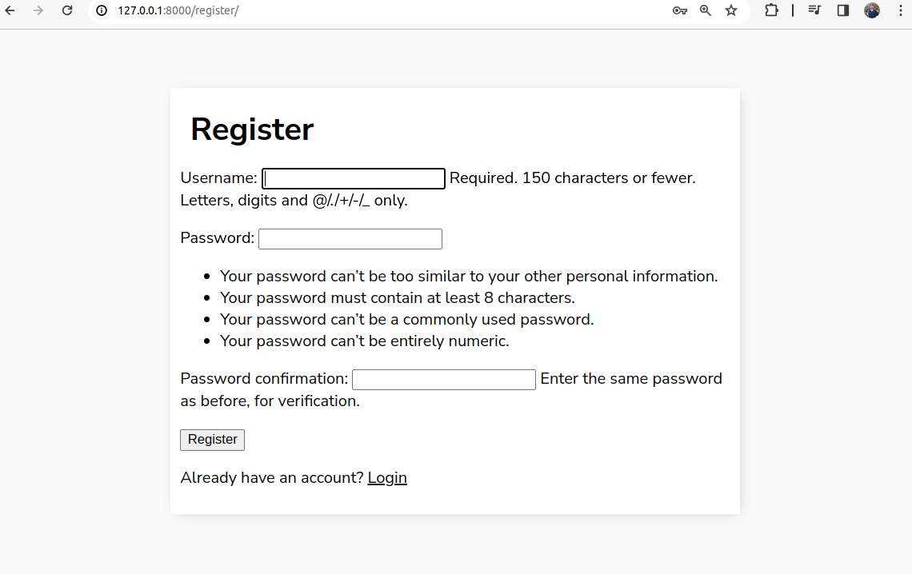
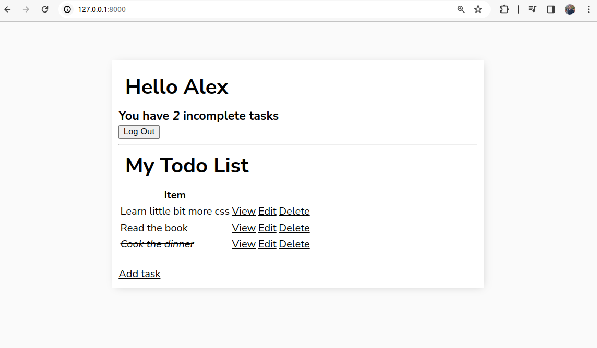

# todo_list_django_project

Implemented class-based view

## How it looks like:

### Login page (from the start)
user1:
log: mks_kh
pass: test1234

user2:
alex
@Test1234

### Registration page

### Home page

### Home page Another User  
each user owns different notes  

### View page

### Create page

### Edit page

